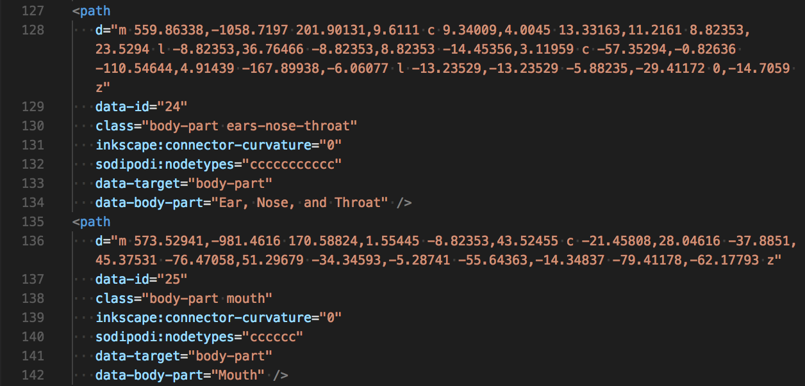
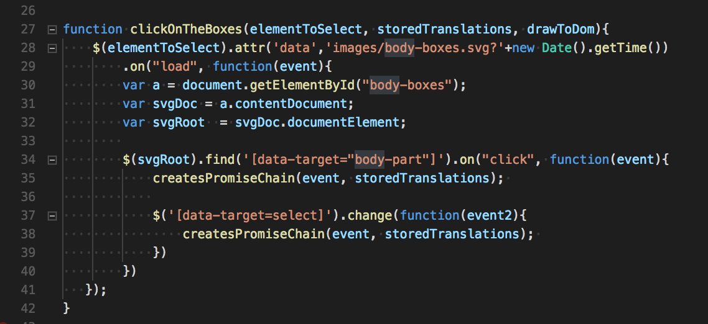
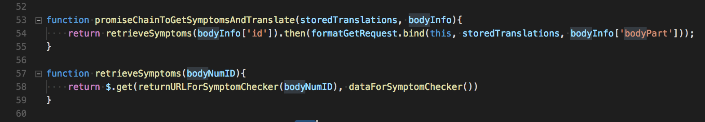
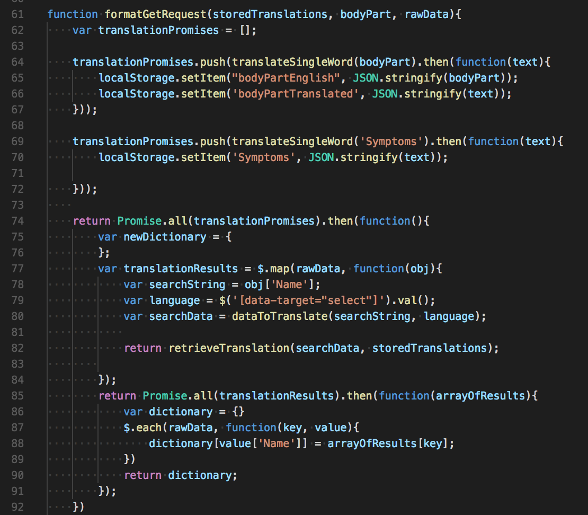
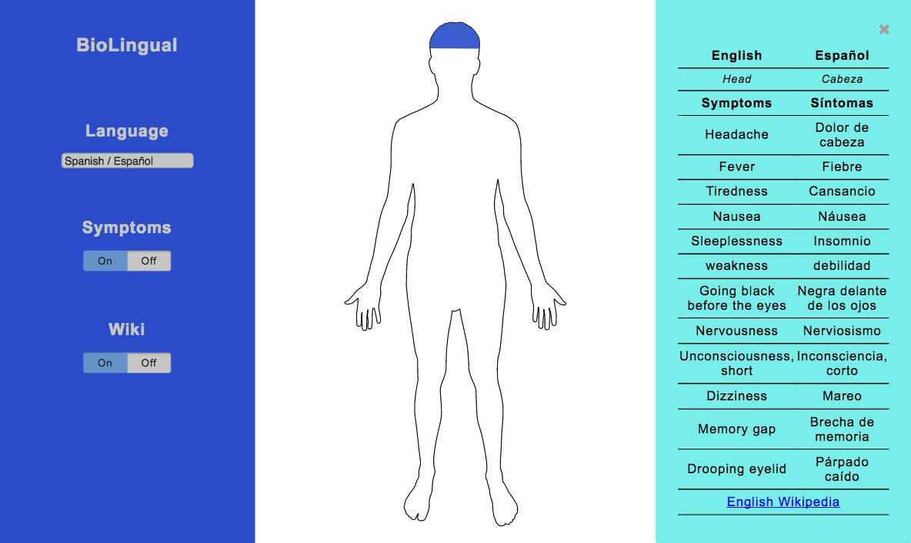
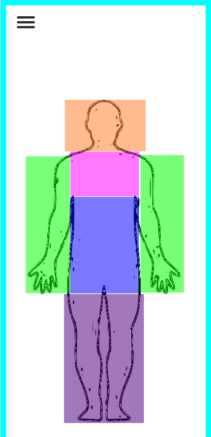

# BioLingual

BioLingual is an interactive anatomy map that translates the names of body parts and commonly associated symptoms using ApiMedic and the Google Translate API. 
Users can click or tap an area of the body on our main body display in order to read a translation of that body part in another language of their choice. 
We believe a future version of BioLingual could help facilitate communication between patients and healthcare providers who do not speak the same language.

## Authors

* **Jennifer Li Johnson** - [jenlij](https://github.com/jenlij)
* **Tim Brady** - [tfb414](https://github.com/tfb414)
* **Nat Ventura** - [nat-ventura](https://github.com/nat-ventura)

## Built With

* JavaScript ES5
* jQuery 3.2.1
* HTML5/CSS3
* Adobe Illustrator CC 2015
* Inkscape
* [ApiMedic](https://apimedic.net/) - Medical Symptom Checker API
* [Google Translate](https://cloud.google.com/translate/) - Google Cloud Platform Translation API

## Getting Started

Since ApiMedic and the Google Translate API provide a limited number of free queries, we have chosen not to host BioLingual live online. Instead we've provided a demo video for a typical use case, but if you would like to try the application on your local machine, please follow these instructions.

#### Mac Instructions
1. Clone or download our repository
2. Update api.js with your ApiMedic and Google Cloud Platorm Translation API (see instructions in apikeys.js)
3. In your console, navigate to the directory containing index.html
4. Run the following console command: python -m "SimpleHTTPServer" 8000
5. In your browser (Chrome works best), go to the URL localhost:8000   

## Demo
[Video -- coming soon!]

## Development Process
* [1. Concept]
* [2. Initial Planning]
* [3. Visualization and Accessing APIs]
* [4. Challenges and Successes!]
* [5. If We Had More Time]

### 1. Concept

Our idea began with the idea of an interactive "body map," where a user would be able to tap a part of the body, and trigger a display of that body part's name and description. When brainstorming the type of information to provide, we realized a translation would create an important new dimension of use for our anatomy app.

### 2. Initial Planning

Early on, at first we were thinking that we would pick a body system such as musculoskeletal or circulatory, and then create labels for those parts alone. However, we soon realized that it would be more efficient within the scope of this project to limit our "selectable" body parts to the topical headings provided by the ApiMedic sandbox toolkit. 

We had also initially hoped to create a map with "zooming" capabilities-- where users could select one body part-- the "foot" for example-- then zoom to view more specific details such as the toes, the ankle, or the sole of the foot. Again we realized that for the scope of this project, we had to limit our anatomy map to a smaller, fixed number of parts. 

We selected the ten languages provided through BioLingual by looking up the ten most spoken languages in the United States. According to the American Community Survey 2015, endorsed by the United States Census Bureau, the ten mostly spoken languages are English, Spanish, Chinese, French, Tagalog, Vietnamese, (**Hindustani - we don't have this one!), Arabic, Korean, German, and Russian.

### 3. Visualization and Accessing APIs

We used scalable vector graphics (SVG) as the basis for our anatomy map
instead of the more common JPEG or PNG image files. For our purposes, the SVG lent itself best to responsive design, where our anatomy outline is able to scale to smartphone size or desktop size without losing quality.

Within the body-boxes.svg file, we attached descriptive data-targets to the shape paths of each body part.

We refer to these data-targets in main.js, and begin a Promise chain to send the name of those data-targets to ApiMedic.

ApiMedic returns a list of all symptoms associated with that body part. Here we retrieve the symptoms corresponding to the `bodyNumId`.

Then, we send a request to the Google Translate API to translate each symptom in the returned list. Within all of our promises we created a function to build out the information that was queried from the APIs. After translating all of the symptoms, we gather the English-language symptoms and their translations into one dictionary.

Finally, we draw our gathered results to the DOM in the form of a "flexboxed" table.

<!-- We attached IDs to each body part shape group, so we knew which body part information to send to the Google Translate API and ApiMedic.
Found a svg body outline from the internet. We used Inkscape to trace sections of the body to turn into “body part” elements.
When you click a body part, it pulls the element ID of that body part, and sends that to ApiMedic. ApiMedic then gives us a list of all symptoms associated with that body part. For each symptom in that list, we send a request to the Google Translate API to translate each symptom. Then gather the translations returned from the Google Translate API and combine those translations with  API’s data into one dictionary. We then draw our results to the DOM, which displays in a table. -->

The result box required generating a box full of the translated information AND symptoms with every click.
A new box is generated every time you click a body part. The whole box is deleted every time the x-box is clicked.

### 4. Challenges and Successes!

A major challenge was making our body part areas clickable.

We first created the clickable body by identifying the major body part areas for which ApiMedic would return information of associated illnesses. The areas in this category were Head, Arms and Hands, Chest, Abdomen, and Legs.

However, at first we didn't know how to draw organic shapes in Illustrator, so we created
colorful rectangles as clickable target boxes.

However, we later learned the correct way to trace organic shapes over pre-existing shapes in the same folder. (When fully highlighted,
our anatomy now looks like a bit more high-tech of a robot.)

 
Since a major objective of our project was to familiarize ourselves with the execution of promise chains, our architecture does not fully account for the implementation of future features-- it's not especially add-on friendly.
 
Asynchronous API load times presented an issue.
Our API keys were not free and required refresh every so many data calls.
We also had problems with the image loading before the `document.ready` fired off. So we had to inject the file into the dom with the `document.ready`.
 
Sometimes the smallest, most subtle features caused the most unexpected challenges. For example, determining the z-index of elements inside our hamburger menu dictated whether users would be able to close the menu more than once. Requiring the results box to "live update" when the language was changed in the menu settings presented a similar challenge.
 
Both issues were fixed by inspecting our hamburger menu's elements in the developer tools, and checking to see what other elements each selection referred to-- and making sure that information was consistent across media queries.

### 5. If We Had More Time

We would...

* Improve results display
* Allow users to toggle between an anterior and posterior display
* Create zoom capability for selected body part
* Add instructions and a welcome page for the user
* Add more organs, organ systems, and associated illnesses
* Make the body 3D using an API like [BioDigital](https://www.biodigital.com/)
* Architect API calls to be more modular

## Closing Thoughts
If we had a lot more time and resources, we could imagine making this application a translation tool for hospitals and medical centers to assist communication between patients and providers.  

## Acknowledgments

Thank you to our wonderful instructors at DigitalCrafts!
* **Chris Aquino** - [radishmouse](https://github.com/radishmouse)
* **Carl Severe** - [mutebard](https://github.com/mutebard)

## Disclaimer
This application does NOT replace professional medical help. If you have a medical issue. please see a physician or call 911. 

## License 
Copyright <2017> <Jennifer Li Johnson, Nat Ventura, Tim Brady>

Permission is hereby granted, free of charge, to any person obtaining a copy of this software and associated documentation files (the "Software"), to deal in the Software without restriction, including without limitation the rights to use, copy, modify, merge, publish, distribute, sublicense, and/or sell copies of the Software, and to permit persons to whom the Software is furnished to do so, subject to the following conditions:

The above copyright notice and this permission notice shall be included in all copies or substantial portions of the Software.

THE SOFTWARE IS PROVIDED "AS IS", WITHOUT WARRANTY OF ANY KIND, EXPRESS OR IMPLIED, INCLUDING BUT NOT LIMITED TO THE WARRANTIES OF MERCHANTABILITY, FITNESS FOR A PARTICULAR PURPOSE AND NONINFRINGEMENT. IN NO EVENT SHALL THE AUTHORS OR COPYRIGHT HOLDERS BE LIABLE FOR ANY CLAIM, DAMAGES OR OTHER LIABILITY, WHETHER IN AN ACTION OF CONTRACT, TORT OR OTHERWISE, ARISING FROM, OUT OF OR IN CONNECTION WITH THE SOFTWARE OR THE USE OR OTHER DEALINGS IN THE SOFTWARE.
